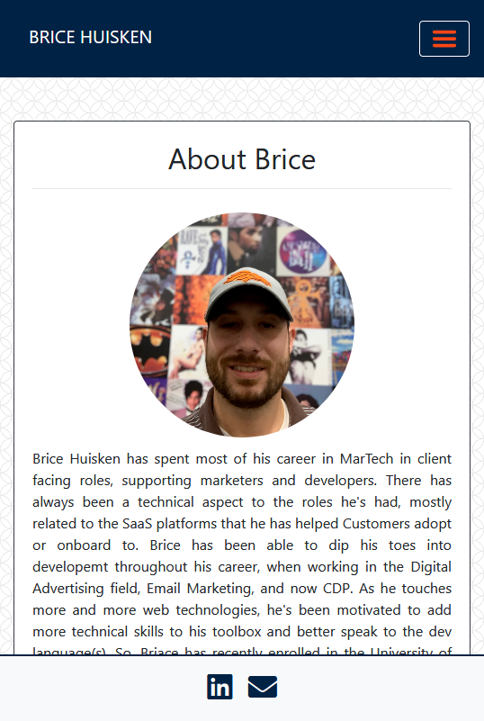
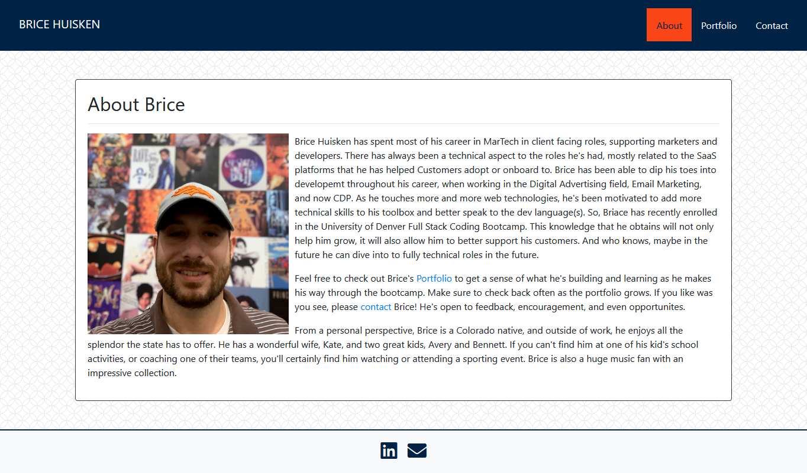

# Responsive Portfolio

For this assignment, I was to create a mobile responsive portfolio site with personalized information (bio, name, images, links to social media, etc.), using the Bootstrap Framework. The requirements for the site, which I have met, are as follows:

* The site contains the following files files: `index.html`, `portfolio.html` and `contact.html`

* Using Bootstrap, the portfolio site is developed with the following items:

   * A consistent navbar on each page with links to the aformentioned pages/files

   * A responsive layout using Bootstrap and minimal use of meia queries, with valid HTML

   * Responsive images

## Deployed Application Link:

https://bahuisken.github.io/Responsive-Portfolio/

## Screenshots

## License
No License